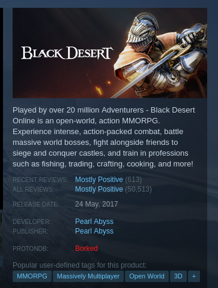

# ProtonDB for Steam
Shows ratings from [protondb.com](https://www.protondb.com/) on Steam

## Installation

### Firefox

### Chrome

[Manually](docs/Install-Manually.md)

> Chrome is not regularly tested. If you're creating an issue, remember to specify your browser and if you tested in Firefox. I'm happy to fix Chrome specific issues, but be aware they will be treated with a lower priority.

## Screenshots

